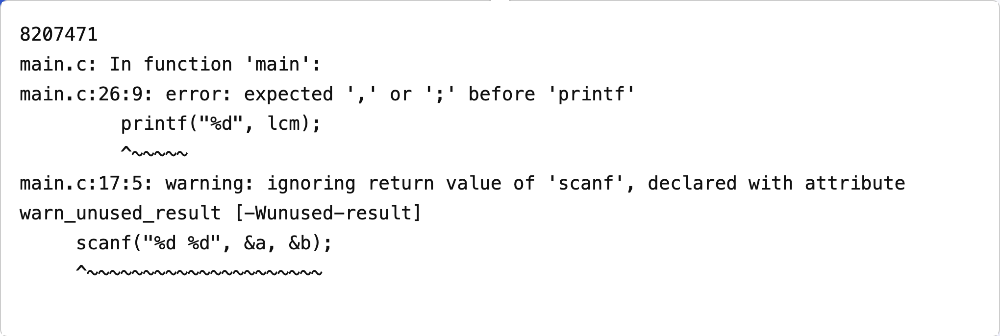
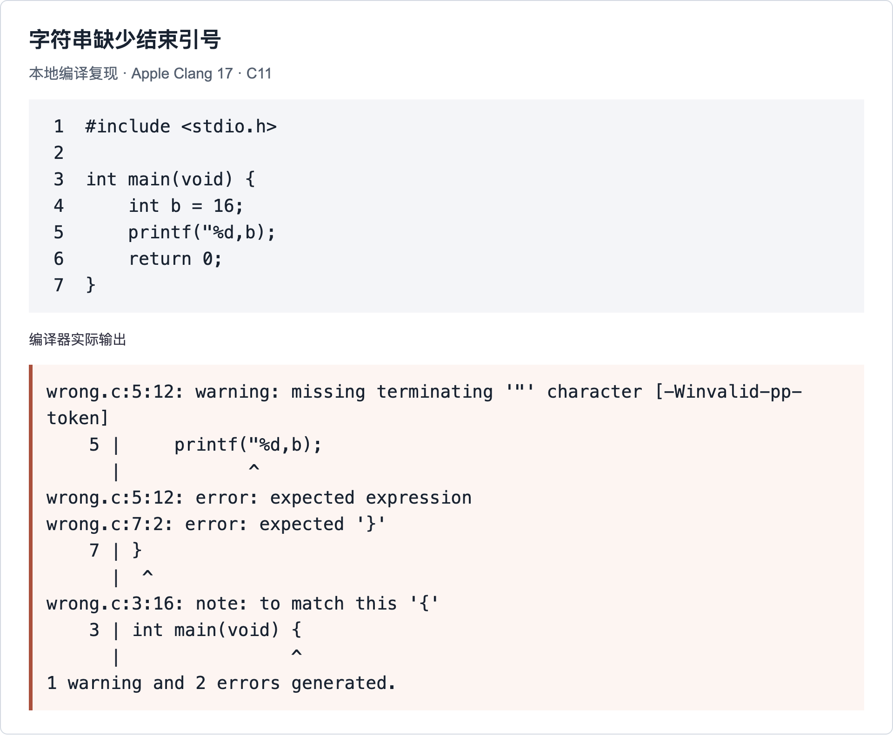
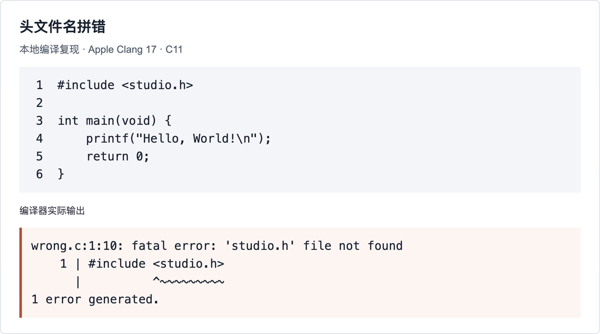
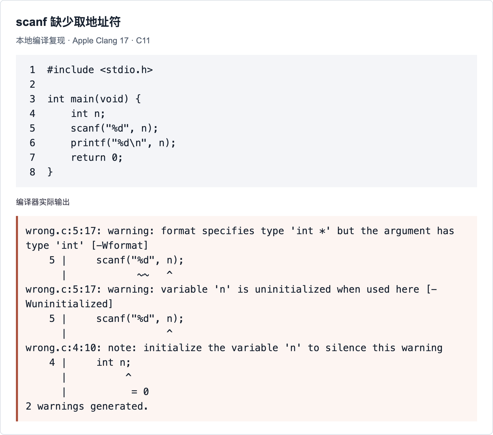

# C 语言代码风格与编译纠错

面向刚开始学习程序设计的同学。先把代码写得清楚，再学会从编译器给出的文件名、行号和提示中定位错误。真实提交取自 2026 级程序设计基础第一次上机赛，示例采用 C11。课程保证输入数据符合题面规定的格式和范围，按要求直接读入即可。

### 1 代码写得清楚有什么用

- 提问时，助教和同学能直接看出变量的作用、条件的范围和循环的层次，把时间用在分析问题上。

- 复盘时，自己能迅速找回当时的思路，分清每一步在读入什么、计算什么、输出什么。

- 修改时，更容易发现少写的大括号、多写的分号和漏掉的分支；增加一行代码也更不容易改变原来的逻辑。

AC 说明程序通过了这道题的测试。缩进混乱的程序也可能 AC；整齐的程序也可能算错。代码风格帮助人理解和检查代码，算法与边界仍要单独验证。

### 从一个完整的小程序开始

```c
#include <stdio.h>

int main(void) {
    int n;
    scanf("%d", &n);

    if (n % 2 == 0) {
        printf("Even\n");
    } else {
        printf("Odd\n");
    }
    return 0;
}
```

函数体缩进一层，if 和 else 的内部再缩进一层。读入和判断之间留一个空行，让输入与后续处理的界限清楚可见。

## 2 让排版和名字表达程序结构

### 一层缩进四个空格 一行只做一件事

下面的循环节选自一份 AC 提交。把循环开头、输出和更新挤在一起，阅读时很难立即看出循环体的范围。

**不推荐的排版**

```c
while(time<n)
{printf("%d ",fr);
    fr=fr+d;
    time++;
   
   
}
```

推荐将循环体统一缩进，并把 time、fr、d 分别改名为 cnt、cur、diff，表示已输出的项数、当前项和公差。变量的声明及其他使用位置也要同步改名。

**推荐写法**

```c
while (cnt < n) {
    printf("%d ", cur);
    cur += diff;
    cnt++;
}
```

- 使用空格分开运算符：sum = a + b；逗号后加空格：scanf("%d%d", &a, &b)。空格用于代码排版，字符串内部的空格则会影响输入输出。

- if、while、for 与左括号之间留空格；函数名与左括号之间通常不留空格。左大括号同行或另起一行都可以，选择一种并保持一致。

- 输入、计算、输出等不同步骤之间空一行。同一段代码不要每行之间都空一行，也不要堆积连续空行。

### 变量名简洁易懂 注释按需添加

鼓励使用简洁且能看懂含义的变量名，常用短英文单词或缩写：sum 表示和，cur（current）表示当前值，diff（difference）表示差值，res（result）表示结果，cnt（count）表示数量。n、i、a、b 在上下文清楚时也可以使用。缩写保持一致，一个变量尽量只承担一个含义。

注释不是必须项。代码含义清楚时可以不写；需要记录公式来源、特殊情况或调试线索时，可以添加简短注释，方便理解和 debug。例如，已知 last 为末项、diff 为公差，下面的注释可按需要保留：

```c
int res = last - (n - 1) * diff; // 由末项反推首项
```

修改代码时同步更新已有注释，避免旧注释干扰调试；删掉已不用的调试输出和变量。

VS Code 中可右键选择“格式化文档”，或在命令面板搜索 Format Document。自动格式化能整理缩进和空格，但不会替你修正条件、补全算法或判断输出是否符合题意。操作见 [VS Code 格式化说明](https://code.visualstudio.com/docs/cpp/cpp-ide)。

## 3 用大括号明确控制范围

### if 后面的分号可能让判断失效

目的：根据 w 的奇偶性，只输出 Even 或 Odd。下面的错误写法取自一份 WA 提交，其中 d = 2。

**错误写法**

```c
if (w - (w / d) * d == 0);
printf("Even");
```

错误原因：条件后面的 ; 是空语句，if 控制的只有这个空语句；printf 会无条件执行。即使将 printf 缩进，也不会改变含义。

**正确写法**

```c
if (w % 2 == 0) {
    printf("Even\n");
} else {
    printf("Odd\n");
}
```

验证：w = 3 时，错误片段仍会输出 Even；正确写法只输出 Odd。

### 缩进不能代替大括号

目的：仅在 b 为 0 时输出并退出，否则继续处理。

**错误写法**

```c
if (b == 0)
    printf("0");
    return 0;
else
    /* 后续处理 */
```

错误原因：if 只控制紧跟的一条语句；return 0; 不属于这个分支，还隔断了 if 与 else，导致 else without a previous if。

**正确写法**

```c
if (b == 0) {
    printf("0\n");
    return 0;
} else {
    /* 后续处理 */
}
```

验证：重新编译后，else 能与 if 正常配对；b = 0 时进入退出分支，b = 5 时进入后续处理。嵌套条件中，else 与最近的未配对 if 结合，缩进不能改变配对。

## 4 先读懂一条编译诊断

编译器把源代码转换成程序，链接器把程序需要的函数实现等内容连接起来。任一阶段失败，OJ 都可能给出 CE。CE 时还没有开始用测试数据运行你的程序。

```c
main.c:26:9: error: expected ',' or ';' before 'printf'
```

| 部分 | 含义 |
| --- | --- |
| main.c | 编译器正在处理的文件名。OJ 可能把你上传的文件统一命名为 main.c。 |
| 26:9 | 第 26 行、第 9 列附近检测到问题。错误原因可能在前一行。 |
| error | 本次构建中的错误，必须处理。fatal error 通常会使当前处理提前停止。 |
| expected … before … | 读到后面的内容时，前面还缺少某种结构；结合源代码判断究竟缺了什么。 |
| ^ 和 ~ | 指出相关位置或范围；它们不是源代码的一部分。 |
| warning 和 note | warning 提醒可能有问题的写法；note 补充位置、类型或配对信息。 |

### 看到一长串报错时这样处理

- 先保存文件，重新编译，确认看到的是当前这份代码的诊断。

- 找到最前面的 error 或 fatal error，同时读它前后相关的 warning、note。缺引号等根因有时先以 warning 出现。

- 跳到对应行，再检查前一条语句，以及这段代码的括号、引号、标点和变量声明。

- 先修复一个明确的根因，重新编译。后面的很多报错可能随之消失；不要一次盲改十几个位置。

- error 消失后继续处理 warning，尤其是输入输出类型不匹配、未初始化、可疑赋值和空循环。最后再用输入验证答案。

### 到哪里找这些信息

在 VS Code 中看本次编译任务的“终端”输出；“问题”面板中的记录可能来自编译器，也可能来自编辑器的代码检查，注意记录的来源。在 OJ 的提交记录中查看 CE 对应的编译信息或错误详情，不要只看“编译错误”这四个字。

warning 默认不一定阻止构建，应结合具体原因和题目约定判断是否需要修改。不同编译器、语言版本和编译选项可能把同一问题诊断成 warning 或 error；开启 -Werror 还会把警告视为错误。详见 [GCC 警告选项](https://gcc.gnu.org/onlinedocs/gcc/Warning-Options.html)。

## 5 报错在下一行 原因是上一行漏分号



### 先把报错与源代码对应起来

这份提交的第 26 行是 printf，本身看起来没有问题。向上检查，发现第 25 行的变量定义没有用分号结束：

**错误写法**

```c
int g = gcd(a, b);
int lcm = a / g * b
printf("%d", lcm);
```

编译器读到 printf 才确定前面的声明没有结束，所以箭头落在 printf 上。这里应结束上一条语句，而不是在 printf 前随意添加逗号。

**正确写法**

```c
int g = gcd(a, b);
int lcm = a / g * b;
printf("%d", lcm);
```

### 修改之后要确认什么

保存并重新编译。对原程序只补这个分号后，本地编译通过；输入 6 8 得到 24，输入 0 8 得到 0。它们验证了这次修改及两个基本分支，并不能代替全部边界测试。

截图中的 ignoring return value of scanf 表示没有使用 scanf 的返回值。课程已保证输入合法，按题面写对格式串和参数即可，无需为这条警告增加输入失败处理。它不是本次 CE 的原因。

分号结束声明、赋值、函数调用、return 等语句。函数定义和普通 if、while 的代码块结束后通常不再加分号。do … while、结构体定义等有自己的语法规则，不能套用“每行末尾都加分号”。

## 6 缺一个引号 为什么会报多个错误



错误原因：截图第 5 行的字符串缺少结束引号，变量 b 也没有放在格式串外。先修 missing terminating；后面的 expected expression 和 expected '}' 可能是连锁诊断，不应先在末尾补大括号。

**正确写法**

```c
printf("%d\n", b);
```

将第 5 行改成上面的写法后，重新编译，警告和错误全部消失，运行输出 16。仅在行尾补一个引号也不够：变量 b 应放在格式串之外，作为 printf 的实参。

另一个错误写法是 printf(“shuru”);。原因是弯引号不能作为 C 字符串的起止符，OJ 会报 stray '\342' 等错误。正确写法为 printf("shuru");，使用英文半角双引号。中文文字可以写在正常的字符串或注释内部。

## 7 头文件和变量名要逐字核对



file not found 或 No such file or directory 表示找不到文件。这里把 stdio.h 拼成了 studio.h，应先修正拼写。真实 CE 记录中也出现了同样的错误。

**正确写法**

```c
#include <stdio.h>
```

改正后重新编译，可能才会暴露出后面的语法错误。例如一份真实提交同时漏了 printf 行末的分号；只修头文件并不会把整份程序一起修好。

### undeclared 表示这个名字在当前位置没有声明

**错误写法**

```c
int count = 0;
coutn++;                 // 拼写与上面的 count 不同
```

错误原因：定义的是 count，使用的却是 coutn，这是两个不同的名字。不要为了消除报错再定义一个 coutn；应改成原本要使用的变量。

**正确写法**

```c
int count = 0;
count++;
```

验证：编译后未声明的报错消失，count 的值变为 1。如果拼写正确仍报 undeclared，再检查声明位置和作用域；在 if 的 { } 内定义的变量不能直接在该代码块外使用。

redefinition、redeclaration 通常提醒你重复定义了名字；若只是给已有变量赋新值，写 count = 0;，不要在同一作用域再次写 int count = 0;。

## 8 scanf 的警告可能对应运行时崩溃



format specifies type 'int *' but the argument has type 'int' 的意思是：%d 对应的 scanf 参数应当是整数的地址，实际却给了整数的值。真实提交中也有 scanf("%d%d", a, b) 被判为运行错误。

**正确写法**

```c
scanf("%d", &n);
```

这里必须给 n 加 &。把 n 初始化为 0 只能改变传入的错误值，不能修复 scanf 需要地址的问题。改正后重新编译没有警告；输入 7，输出 7。

读入单个数值变量通常传 &变量；输出它则传变量本身：printf("%d", n)。字符串数组读入有不同规则，不能把“所有 scanf 参数都加 &”当作通用口诀。

## 9 输入输出要逐项匹配

### 格式符 类型和实参个数一起检查

| 变量声明 | scanf 写法 | printf 写法 |
| --- | --- | --- |
| int n; | scanf("%d", &n); | printf("%d", n); |
| long long n; | scanf("%lld", &n); | printf("%lld", n); |
| float x; | scanf("%f", &x); | printf("%f", x); |
| double x; | scanf("%lf", &x); | printf("%f", x); |
| char ch; | scanf("%c", &ch); | printf("%c", ch); |

scanf 的 %f 与 %lf 分别对应 float * 与 double *。printf 输出浮点数时，float 会先提升为 double，因此都可以用 %f；C99 及以后的 printf 也允许 %lf，不能据此认为 scanf 中二者可以混用。可查阅 [C11 草案第 7.21.6 节](https://www.open-std.org/jtc1/sc22/wg14/www/docs/n1570.pdf)。

### 格式串必须用英文双引号包住

**错误写法**

```c
scanf(%d, &x);
```

错误原因：%d 在这里应是字符串中的格式说明；没有双引号，编译器会按 C 表达式解析 %，因此报 expected expression before '%' token。

**正确写法**

```c
scanf("%d", &x);
```

验证：假设 x 是 int，输入 7 时成功读入一个整数，x 变为 7。

### 每个格式符都要有类型匹配的实参

目的：把整数 x 代入下面文本中的两个位置。

**错误写法**

```c
printf("4*(%d+2)/4*(%d)+2", x);
```

错误原因：有两个 %d，却只提供一个整数。printf 不会自动重复使用 x；读取缺少的实参属于未定义行为，不能依赖某次输出。

**正确写法**

```c
printf("4*(%d+2)/4*(%d)+2", x, x);
```

验证：x = 3 时输出文字 4*(3+2)/4*(3)+2。如果题目要求表达式的计算结果，这种文本输出仍不符合题意，应按下一节的方法把运算写到引号外。

## 10 格式串中的文字 空格和标点

### 输出表达式的值时 计算应放在引号外

目的：n = 3 时输出 4。

**错误写法**

```c
printf("n + 1");
```

错误原因：引号内是普通文字，不会查找变量 n，也不会计算加法；实际输出是 n + 1。

**正确写法**

```c
printf("%d\n", n + 1);
```

验证：n = 3 时输出 4；n = 0 时输出 1。

### 输入的分隔方式必须与格式串一致

目的：读入空格分隔的两个整数，例如 3 5。

**错误写法**

```c
scanf("%d,%d", &a, &b);
```

错误原因：格式串中的逗号要求输入中也出现逗号。输入 3 5 时，第一个数能读到，匹配逗号时失败，b 不会被这次调用赋值。

**正确写法**

```c
scanf("%d%d", &a, &b);
```

验证：输入 3 5 时，a = 3、b = 5。若题目确实规定输入 3,5，带逗号的格式串才是正确选择。输入保证合法，格式串仍需由程序按题面正确书写。

### 另外三种容易混淆的格式

- 读取下一个非空白字符：读完整数后直接 scanf("%c", &ch) 可能读到遗留换行，因为 %c 不会跳过空白。此时正确写法是 scanf(" %c", &ch)。若空格本身也是有效数据，就应保留 "%c"。

- 普通数值输入：不要写 scanf("%d\n", &n) 来“吃掉一个回车”。末尾空白会继续匹配输入空白，交互输入可能一直等待；只读整数时写 scanf("%d", &n)。

- 输出百分号：printf("50%") 中单独的 % 不是有效的转换说明。正确写法是 printf("50%%")，其中 %% 表示一个字面的 %，输出为 50%。

严格按题面输出大小写、标点、空格和换行。除非题目要求，不输出“请输入”、中间变量或调试提示。

## 11 找不到函数实现和语言选错

### undefined reference 是链接阶段的线索

以下是本场一份真实 CE 记录的关键诊断。要读缺少的函数名，不能只看最后一句 ld returned 1 exit status。

```c
warning: implicit declaration of function 'scanf_s'
undefined reference to `scanf_s'
collect2: error: ld returned 1 exit status
```

**本场环境中无法链接的写法**

```c
scanf_s("%d", &n);
```

错误原因：本场 OJ 环境没有提供 scanf_s 的实现，链接器无法把这个调用连接到实际函数。关闭警告不会生成缺失的函数实现。

**本例正确写法**

```c
scanf("%d", &n);
```

这里 n 是 int。标准输入函数 scanf 在本场可用；改名后重新构建，确认 undefined reference 消失。

scanf_s 在部分环境中可用，尤其是一些 Windows 教学环境，但不能假设它在所有 OJ 上都可用。若涉及字符串等带额外参数的调用，不要对整份代码进行不加检查的名称替换。

| 诊断提到的名字 | 应检查什么 |
| --- | --- |
| print、prinf、printF | C 标准输出函数是 printf，核对拼写与大小写。若确实想调用自定义函数，要提供声明和实现。 |
| main | 检查是否写成 Main、mian，是否没有提交完整主函数。不要只提交一段语句。 |
| 自己写的函数名 | 只有函数声明而没有函数体，或实现文件没有参与构建，也会缺少实现。 |
| sqrt、pow 等数学函数 | 先包含 math.h；部分 GCC 环境链接数学库需要在命令末尾加 -lm。按实际环境处理。 |

### C 与 C++ 的编译环境不能混用

本场所有提交记录的语言栏都是 c，却有提交包含 iostream、cstdio 或 bits/stdc++.h，随后报 No such file or directory。这些不是 C 的标准头文件。

- 按 C 语言完成作业时，使用 .c 文件、C 的头文件与写法，并在 OJ 中选择 C。

- 只有当课程与比赛允许 C++，且你确实在写 C++ 时，才使用 .cpp 文件与 C++ 编译器，并选择相应语言。仅改文件扩展名不会自动转换代码。

没有头文件、缺少函数声明、缺少函数实现是不同问题。根据诊断中的具体文件名或函数名排查，不要不断添加无关的 #include。

## 12 赋值 比较和范围判断

### 判断相等应使用两个等号

目的：判断 n 是否等于 0，并且不改变 n 的值。

**错误写法**

```c
if (n = 0) { /* 处理 n 为 0 的情况 */ }
```

错误原因：= 是赋值。它先把 n 改为 0，再把赋值表达式的值 0 当作条件，所以分支不会执行。这种写法可能只产生警告，仍能编译。

**正确写法**

```c
if (n == 0) { /* 处理 n 为 0 的情况 */ }
```

验证：n = 0 时，正确写法进入分支，错误写法不进入；n = 5 时，正确写法保留 n = 5，错误写法会把 n 改成 0。

### 取模的结果可以比较 不能被赋值

**错误写法**

```c
if (n % 2 = 0) { /* 处理偶数 */ }
```

错误原因：n % 2 是计算结果，不是可以写入的变量；= 左侧不能是它，因此报 lvalue required as left operand of assignment 等错误。

**正确写法**

```c
if (n % 2 == 0) { /* 处理偶数 */ }
```

验证：修改后能编译；n = 4 时进入分支，n = 3 时不进入。

### 一个范围要拆成两个比较

目的：判断 n 是否位于 0 到 10000 的闭区间。

**错误写法**

```c
if (0 <= n <= 10000) { /* 在范围内 */ }
```

错误原因：先计算 0 <= n，得到 0 或 1，再判断这个结果是否不大于 10000。因此这个条件总为真，不能限制 n 的范围。

**正确写法**

```c
if (0 <= n && n <= 10000) { /* 在范围内 */ }
```

验证：n = -3 或 10001 时，错误写法仍进入分支，正确写法不进入；n = 0、10000 时，正确写法均进入。

## 13 整数除法和乘法溢出

### 需要小数商时 不能先做整数除法

目的：让 x 保存 3 除以 2 的结果 1.5。

**错误写法**

```c
double x = 3 / 2;
```

错误原因：两个操作数都是整数，先做整数除法得到 1，之后才转换成 double。结果变量的类型不会反过来改变之前已经发生的运算。

**正确写法**

```c
double x = 3.0 / 2;
```

验证：用 printf("%.1f", x) 输出，错误写法得到 1.0，正确写法得到 1.5。若 a、b 都是 int 变量且 b 不为 0，可写 double x = (double)a / b;，先把 a 转成浮点数。

### 大整数乘法要在相乘之前扩大类型

目的：a、b 都是 int，且都为 50000，计算乘积 2500000000。以下按常见的 32 位 int 环境说明。

**错误写法**

```c
long long product = a * b;
```

错误原因：a * b 仍先按 int 计算，乘积超出 int 上限 2147483647。有符号整数溢出属于未定义行为，不能保证得到某个固定错误值；之后存入 long long 也无法补救。

**正确写法**

```c
long long product = 1LL * a * b;
```

1LL 是 long long 类型的整数常量，让乘法从第一步就使用 long long。验证：printf("%lld", product) 输出 2500000000。还要确保全部中间结果都在所选类型范围内。

### 平方不能用异或符号代替

目的：x = 3 时得到平方 9，且本例结果在 int 范围内。

**错误写法**

```c
int square = x ^ 2;
```

错误原因：^ 是按位异或，3 的二进制 11 与 2 的二进制 10 异或得到 01，结果为 1；它不是乘方符号。

**正确写法**

```c
int square = x * x;
```

验证：x = 3 时得到 9。若 x 较大，按上一例使用足够宽的类型，例如 long long square = 1LL * x * x;。

## 14 复合条件 负数和除零

### 要求两个条件都满足 应使用逻辑与

目的：只有 a 和 b 都大于 0 时才进入分支。

**错误写法**

```c
if (a > 0, b > 0) { /* 两者都为正 */ }
```

错误原因：逗号表达式最终取右侧 b > 0 的值，a 的比较结果不会决定是否进入分支。

**正确写法**

```c
if (a > 0 && b > 0) { /* 两者都为正 */ }
```

验证：a = -1、b = 2 时，错误写法会进入分支，正确写法不会。若要求“至少一个为正”，才应改用 ||。

### 判断奇数要考虑题目允许的负数

**错误写法**

```c
if (n % 2 == 1) { /* 处理奇数 */ }
```

错误原因：在 C11 中，负数取模的非零余数与被除数同号，例如 -3 % 2 为 -1。与 1 比较会漏掉负奇数。若题目保证 n 非负，这种判断才足以覆盖其输入。

**适用于正负整数的正确写法**

```c
if (n % 2 != 0) { /* 处理奇数 */ }
```

验证：n = -3、3 时进入分支；n = -2、0、2 时不进入。

### 必须先判断除数 再做取模

目的：仅在 b 不为 0 且 a 能被 b 整除时进入分支。本例假设 a、b 为非负 int。

**错误写法**

```c
if (a % b == 0 && b != 0) { /* 可以整除 */ }
```

错误原因：&& 从左向右判断，执行 a % b 时尚未检查 b。b = 0 会先触发非法取模，右侧判断已经来不及保护它。

**正确写法**

```c
if (b != 0 && a % b == 0) { /* 可以整除 */ }
```

验证：a = 6、b = 0 时，左侧为假，&& 短路跳过右侧，不会取模；a = 6、b = 3 时进入分支。整数除法也要先处理零除数。不能改成 (b != 0) & (a % b == 0)：按位 & 不提供这种短路保护。

## 15 变量初值和循环边界要能解释

### 先使用再赋值 常常藏在循环条件里

一份 WA 提交的非零分支有下面的结构。

**错误写法**

```c
int c, d;
int n = 1;
while (c != 0 || d != 0) {
    n++;
    c = n % a;
    d = n % b;
}
```

错误原因：第一次判断条件时，c、d 还没有初始化，使用它们的值属于未定义行为。也不能随意把它们设成 0，那会让循环直接跳过。如果要从 n = 1 开始找能被两个正整数整除的数，可以直接检查当前候选数：

**正确写法**

```c
int n = 1;
while (n % a != 0 || n % b != 0) {
    n++;
}
```

验证：a = 2、b = 3 时，n 从 1 增加到 6 后停止；a = b = 1 时，n = 1 已满足要求，不进入循环。这里假设 a、b 均为正且答案在 int 范围内。逐个枚举可能很慢，本例只说明初值和条件，正式解题要按数据范围选择算法。

写循环时一起确定初值、结束条件和更新语句。要循环 n 次，可以从 i = 0 循环到 i < n，也可以从 i = 1 循环到 i <= n；不要混用这两组边界。每轮都要能正常更新影响条件的变量。

数组 int a[10] 的合法下标是 0 到 9。若循环从 i = 0 开始，错误条件 i <= 10 会多访问 a[10]；正确条件是 i < 10，恰好访问十个元素。没有报错或某次恰好能运行，都不能说明越界是正确的。

### while 后面多一个分号会形成空循环

**错误写法**

```c
while (i < n);
    i++;
```

错误原因：; 已构成循环体，i++ 在循环外。若初始 i = 0、n = 3，循环内没有更新 i，就不能正常到达后面的自增。

**正确写法**

```c
while (i < n) {
    i++;
}
```

验证：初始 i = 0、n = 3 时，自增三次，i = 3 后退出。for 也要避免右括号后多写分号，但 for 括号内部的三个部分必须用两个分号分隔。

## 16 重新编译 验证 再提交或提问

### 确保运行的是这次编译得到的程序

打开源文件所在目录的终端，保存 main.c 后编译。下面以已安装并配置好的 GCC 为例：

```c
gcc main.c -std=c11 -Wall -Wextra -Wpedantic -o main.exe
```

编译成功后，Windows PowerShell 中执行 .\main.exe。在 macOS 或 Linux 中，输出文件通常命名为 main，示例为：

```c
clang main.c -std=c11 -Wall -Wextra -Wpedantic -o main
./main
```

-std=c11 指定语言标准；-Wall、-Wextra 和 -Wpedantic 帮助发现更多问题，但不等于检查所有错误。构建失败后不要继续运行目录里遗留的旧程序。成功构建通常没有 error，进程退出码为 0，也不要求终端一定打印“编译成功”。

如果提示“无法识别 gcc”或 command not found，先检查编译器安装与 PATH；这不是源代码里的语法错误。如果提示 main.c 不存在，先检查当前目录与文件名。

### 用小输入验证刚才修的地方

先跑题目样例，再选能触发修改位置的小数据。例如修了奇偶判断，分别测 0、2、3；题目允许负数时再测 -3。修了循环，先测只循环一次和恰好在边界结束的情况。写清楚预期输出，再与实际输出逐项比较。

重新提交前，确认复制的是已保存并验证过的完整源代码，语言选择正确，临时输出已经删除。编译通过只是开始运行的前提。

### 提问时让别人可以复现

给出题目链接或编号、完整且已格式化的代码、编译器与语言选项、第一处相关报错原文。如果已经能运行，再附上触发问题的输入、预期输出、实际输出，以及自己试过的修改。

```c
题目：判断一个整数的奇偶性
环境：GCC，C11
输入：3
预期输出：Odd
实际输出：EvenOdd
已检查：输入读到了 3；怀疑 if 后面的分号导致无条件输出。
代码：在下面的代码块中粘贴完整程序。
```

代码和报错优先用可复制的文字。Markdown 中用三个反引号加 c 开始代码块，末尾再写三个反引号。截图用于补充说明报错位置或界面状态；不要只发一张看不清的小图，或一句“为什么过不了”。
